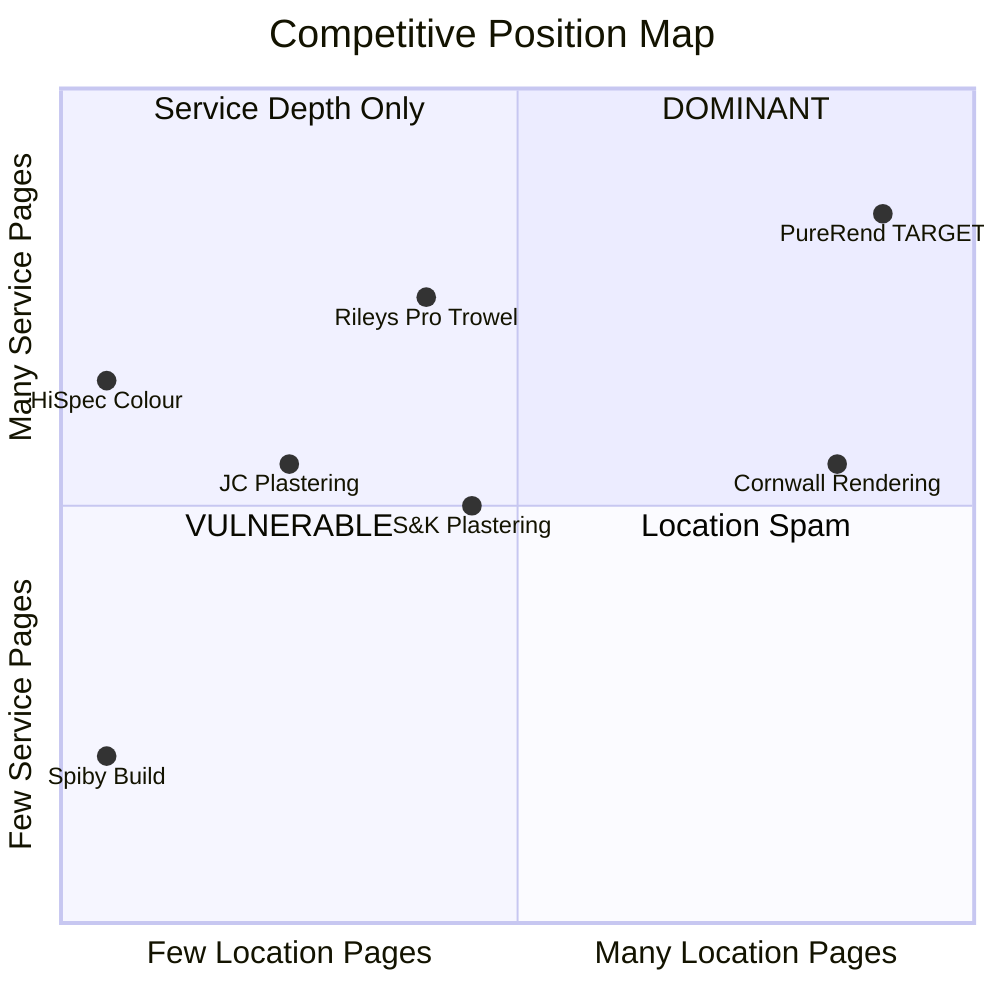
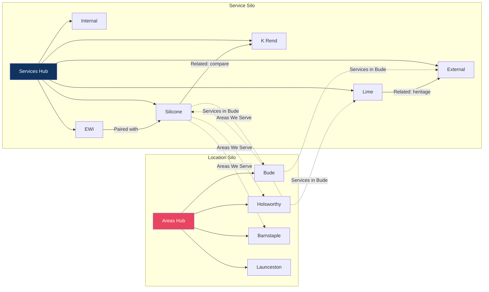

# PureRend — SEO Competitor Analysis & Site Architecture Blueprint v2.0

> **Objective:** Dominate local map packs and organic search for plastering & rendering keywords across the Bude, North Cornwall, and North Devon corridor.
> **Date:** 4 April 2026 | **Version:** 2.0 (3× density)

---

## 1. Competitive Landscape — Deep Audit

### 1.1 Competitor Matrix

| # | Business | URL | Location | Tech Stack | Total Pages | Service Pages | Location Pages | Blog | Schema | Rating |
|---|---------|-----|----------|-----------|-------------|--------------|----------------|------|--------|--------|
| 1 | Cornwall Rendering Co | cornwallrenderingco.co.uk | Cornwall-wide | WordPress + Divi 4.14.4 | ~40 | 7 | **30+** | ✗ | ✗ | N/A |
| 2 | S&K Plastering | s-kplastering.co.uk | Exeter | WordPress + Elementor 3.35.7 | ~17 | 5 | **5** | ✗ | ✗ | ★★★★★ (4 reviews) |
| 3 | Rileys Pro Trowel | rileysprotrowel.co.uk | Plymouth | WordPress + Divi 4.27.4 | ~20 | **7** | 6 (county-level) | ✓ (4 posts) | ✗ | N/A |
| 4 | Brokenshire Plastering | brokenshireplastering.com | Fraddon, Cornwall | WordPress | 5 | 3 | ✗ | ✗ | ✗ | N/A |
| 5 | Spiby Build | spibybuild.com | **Bude** | **Next.js** (modern) | 6 | 2 | ✗ | ✗ | ✗ | N/A |
| 6 | HiSpec Colour Rendering | hispeccolourrendering.co.uk | Torquay, Devon | Duda (CDN-hosted) | ~8 | 4 | ✗ | ✓ | ✗ | ★★★★★ (Google) |
| 7 | Devon Rendering Co | devonrendering.co.uk | Devon-wide | WordPress + Divi 4.14.4 | ~35 | 7 | **30+** (county mirror) | ✗ | ✗ | N/A |
| 8 | Westcott Plastering | westcottplastering.co.uk | Exeter | WordPress + Elementor | ~6 | 1 (hub) | ✗ | ✗ | ✗ | N/A |
| 9 | JC Plastering & Lime | jcplasteringandlime.co.uk | Bideford | WordPress + WPBakery | ~15 | **7** | **3** | ✓ | ✗ | N/A |
| 10 | NA Parsons Plastering | naparsonsplastering.co.uk | Exeter | WordPress 6.3.2 (outdated) | ~5 | 1 | ✗ | ✗ | ✗ | N/A |

### 1.2 Competitive Position Map



> [!IMPORTANT]
> **No single competitor occupies the top-right quadrant.** Cornwall Rendering has location breadth but thin services. Rileys has service depth but county-level locations only. **PureRend can own both axes simultaneously.**

### 1.3 Deep Content Teardown — Service Pages

Analysis of the "Silicone Rendering" page across 5 competitors (the highest-value service page in this niche):

| Metric | Cornwall Rendering | Rileys Pro Trowel | Brokenshire | Spiby Build | HiSpec |
|--------|-------------------|-------------------|-------------|-------------|--------|
| **Title Tag** | "Silicone Rendering Cornwall \| Cornwall Rendering" | "Silicone Based External Rendering \| Plymouth, Somerset, Cornwall" | "Silicon Thin Coat Render System - brokenshireplastering" | "Silicone Rendering Cornwall \| Specialist External Render Systems \| Spiby Build" | "Silicone Rendering by HiSpec Colour Rendering \| Devon" |
| **Meta Description** | ✗ Missing | "We specialise in all aspects of plastering..." (generic) | "A silicon thin coat render system gives your property a clean, modern finish..." (good) | "Specialist silicone rendering systems in Bude and North Cornwall..." (excellent) | "Add a long lasting breath of fresh life to your home..." (good) |
| **H1** | "Silicone Rendering Cornwall" | "Silicone Based Rendering" | "Silicon Thin Coat Render System" | "Silicone Rendering Systems" | "Silicone Render" |
| **Word Count** | ~200 (thin) | ~120 (very thin) | ~550 (solid) | ~650 (excellent) | ~800 (best) |
| **FAQ Section** | ✗ | ✗ | ✗ | ✓ 5 FAQs | ✗ |
| **FAQ Schema** | ✗ | ✗ | ✗ | ✗ (not marked up) | ✗ |
| **Process Steps** | ✗ | ✗ | ✗ | ✓ 4 steps | ✓ 6 steps |
| **Benefits List** | ✓ 8 bullet points | ✓ 3 paragraphs | ✓ 5 bold sections | ✓ 6 cards with icons | ✓ 5 numbered cards |
| **Gallery** | ✓ (shared across pages) | ✓ 5 images | ✓ Gallery lightbox | ✓ 1 hero image | ✓ Multiple images |
| **Testimonials** | ✗ | ✗ | ✗ | ✗ | ✓ 3 reviews |
| **CTA Quality** | Generic "Contact" link | "CALL NOW" tel link | "GET A FREE QUOTE" | "Get a Rendering Quote" | "Free Quote" x6 |
| **Internal Links to Locations** | ✗ | ✗ | ✗ | ✗ | ✗ |
| **Manufacturer Partners** | ✗ mentioned | ✗ | ✓ Wetherby's (approved) | ✗ | ✓ SAS, Weber, VPI |

> [!TIP]
> **Content length benchmark to beat:** HiSpec at ~800 words. PureRend should target **1,200+ words** per service page to definitively outrank. Include FAQ schema, process steps, gallery, testimonials, AND location links — no competitor does all of these on a single service page.

### 1.4 Deep Content Teardown — Location Pages

Analysis of competitor location pages (cornwallrenderingco.co.uk/rendering-in-bude vs s-kplastering.co.uk/plastering-rendering-company-newton-abbot):

| Metric | Cornwall Rendering (Bude) | S&K Plastering (Newton Abbot) |
|--------|---------------------------|-------------------------------|
| **Title Tag** | "Rendering in Bude \| Cornwall Rendering" | "Plastering & Rendering Company Newton Abbot \| Contact Us" |
| **Word Count** | ~500 | ~150 (very thin) |
| **Unique Content** | ✓ References Bude streets, property types, thermal performance stats | ✗ Generic boilerplate copy with town name swapped |
| **Google Map** | ✗ | ✓ Embedded static map |
| **Links to Services** | ✓ "Types of Render" link | ✓ Links to 4 service pages |
| **Local Landmarks** | Partial — mentions "walk down any street in Bude" | ✗ |
| **Case Studies** | ✗ | ✗ |
| **Testimonials** | ✗ | ✗ |
| **Energy Saving Stats** | ✓ Cites Energy Saving Trust (£455/year saving) | ✗ |
| **Schema** | ✗ | ✗ |

> [!WARNING]
> **Cornwall Rendering's Bude page is the #1 page to outrank.** At ~500 words it's decent but lacks testimonials, case studies, or FAQ schema. S&K's location pages are dangerously thin at ~150 words — don't replicate this pattern. PureRend location pages must be **500+ words of genuinely unique, locally-specific content**.

### 1.5 Meta Tag Patterns — What's Working

| Pattern | Example | Who Uses It | PureRend Should... |
|---------|---------|-------------|-------------------|
| `[Service] [Location] \| [Brand]` | "Silicone Rendering Cornwall \| Cornwall Rendering" | Cornwall Rendering | ✓ Adopt — clean, keyword-first |
| `[Service] [Location] \| Specialist [Service Type] \| [Brand]` | "Silicone Rendering Cornwall \| Specialist External Render Systems \| Spiby Build" | Spiby Build | ✓ Use for hero service pages |
| `[Service] Based [Type] \| [City], [County], [County]` | "Silicone Based External Rendering \| Plymouth, Somerset, Cornwall" | Rileys | ✗ Too many locations — dilutes focus |
| `Plastering & Rendering Company [Town] \| Contact Us` | S&K's location pages | S&K | ✗ Weak — "Contact Us" wastes title real estate |

---

## 2. Keyword Intelligence

### 2.1 Primary Service Clusters

| Cluster | Head Term | Long-Tail Variants | Est. Monthly Volume | Search Intent | SERP Features |
|---------|-----------|--------------------|--------------------|---------------|---------------|
| **Silicone Rendering** | silicone rendering Cornwall | silicone render near me, silicone render cost per m2, best silicone render, silicone render vs k rend, silicone render colours, silicone rendering system | 400–800 | Commercial | Map pack, organic, PAA |
| **K Rend / Monocouche** | k rend Cornwall | k rend colours, k rend cost, monocouche render, k rend finish types, k rend silicone scraped | 200–400 | Commercial / Info | Organic, PAA |
| **Lime Rendering** | lime render Cornwall | lime plastering Devon, lime render old house, lime render heritage property, lime putty render, lime wash | 300–500 | Commercial / Info | Organic, PAA |
| **External Rendering** | external rendering Cornwall | house rendering near me, render my house, external wall rendering cost, how much to render a house | 600–1,000 | Commercial | Map pack, PAA, featured snippet |
| **Internal Plastering** | plasterer Bude | plasterer near me, plastering services, skim coat plastering, plasterboarding | 500–900 | Commercial | Map pack, organic |
| **Sand & Cement** | sand and cement rendering | traditional rendering, cement render, roughcast render, Tyrolean render | 150–300 | Info / Commercial | Organic, PAA |
| **EWI** | external wall insulation Cornwall | solid wall insulation cost, EWI rendering, external insulation grant | 200–400 | Commercial / Info | Organic, PAA, featured snippet |
| **Damp Proofing** | damp proofing Cornwall | damp proof rendering, tanking Cornwall, penetrating damp render | 200–350 | Commercial | Map pack, organic |
| **Machine/Spray Render** | spray rendering Cornwall | machine render, spray plaster, render spraying near me | 100–200 | Commercial | Organic |
| **Decorative** | venetian plaster Cornwall | polished plaster, micro cement, decorative plaster finishes | 80–150 | Commercial / Info | Organic, images |
| **Pebble Dash** | pebble dash removal Cornwall | render over pebble dash, pebble dash replacement | 100–200 | Commercial / Info | PAA, featured snippet |
| **Scratch Coat** | scratch back rendering | scratch coat render, bonding coat | 50–100 | Info | Organic |

### 2.2 Location Modifier Intelligence

**Tier 1 — Core Territory (highest priority, within 20mi of Bude):**

| Town | Population | Property Type Mix | Coastal? | Rendering Demand Signal | Content Angle |
|------|-----------|-------------------|----------|------------------------|---------------|
| **Bude** | ~6,500 | Holiday lets, coastal cottages, Victorian terraces | ✓ | Very High — salt/weather damage | "Coastal-grade silicone rendering that withstands Atlantic storms" |
| **Holsworthy** | ~2,600 | Farmhouses, new builds, detached | ✗ | High — rural renovation | "Transforming rural Devon properties, from farmhouses to new builds" |
| **Stratton** | ~1,500 | Period properties, conservation area | ✗ | Medium — heritage | "Heritage-sensitive lime rendering in Stratton's conservation area" |
| **Widemouth Bay** | ~350 | Holiday homes, coastal exposed | ✓ | High — extreme weather | "Weather-proof rendering for Widemouth Bay's exposed coastline" |
| **Kilkhampton** | ~1,100 | Village cottages, agricultural | ✗ | Medium | "Professional rendering for Kilkhampton village properties" |
| **Marhamchurch** | ~1,000 | Traditional cottages | ✗ | Medium | "Sympathetic rendering for Marhamchurch's traditional cottages" |
| **Bideford** | ~17,000 | Mixed — Victorian, new estates | ✗ | High — population | "Full rendering services for Bideford's diverse property stock" |
| **Barnstaple** | ~24,000 | Town centre, suburbs, new builds | ✗ | Very High — largest town | "North Devon's leading rendering specialists serving Barnstaple" |
| **Launceston** | ~8,500 | Historic gateway town, mixed | ✗ | High | "Rendering specialists at the gateway to Cornwall — Launceston" |
| **Camelford** | ~3,400 | Market town, stone buildings | ✗ | Medium | "Expert rendering for Camelford's stone-built market town properties" |

**Tier 2 — Extended Reach (20–40mi):**

| Town | Key Content Angle |
|------|-------------------|
| Wadebridge | "Serving the Camel Estuary — weather-resistant rendering in Wadebridge" |
| Padstow | "Premium finishes for Padstow's high-value coastal properties" |
| Bodmin | "Rendering services for Bodmin and the A30 corridor" |
| Okehampton | "Dartmoor-edge properties — rendering that handles extreme weather" |
| Great Torrington | "Traditional and modern rendering across Great Torrington" |
| Ilfracombe | "Coastal rendering specialists serving Ilfracombe's Victorian seafronts" |
| Tavistock | "West Devon rendering — from Tavistock town to Dartmoor farms" |
| Liskeard | "East Cornwall rendering experts — Liskeard and surrounding villages" |
| Tintagel | "Heritage-grade rendering for Tintagel's historic properties" |
| Boscastle | "Flood-resilient, breathable rendering for the Boscastle valley" |

**Tier 3 — County Anchors:**
North Cornwall, North Devon, Cornwall, Devon, South West

---

## 3. Complete Site Map

### 3.1 Architecture Overview

```mermaid
graph TD
    HOME["/ Home"] --> SERVICES["/services — Service Hub"]
    HOME --> AREAS["/areas — Location Hub"]
    HOME --> PROJECTS["/projects — Portfolio"]
    HOME --> ABOUT["/about — Meet the Founder"]
    HOME --> CONTACT["/contact — Contact & Quote"]
    HOME --> BLOG["/blog — Insights & Guides"]

    SERVICES --> S1["/services/silicone-rendering"]
    SERVICES --> S2["/services/k-rend-monocouche"]
    SERVICES --> S3["/services/lime-rendering"]
    SERVICES --> S4["/services/external-rendering"]
    SERVICES --> S5["/services/internal-plastering"]
    SERVICES --> S6["/services/sand-cement-rendering"]
    SERVICES --> S7["/services/external-wall-insulation"]
    SERVICES --> S8["/services/damp-proofing"]
    SERVICES --> S9["/services/machine-spray-rendering"]
    SERVICES --> S10["/services/decorative-plastering"]
    SERVICES --> S11["/services/pebble-dash-removal"]
    SERVICES --> S12["/services/dry-lining"]

    AREAS --> A1["/areas/rendering-bude"]
    AREAS --> A2["/areas/rendering-holsworthy"]
    AREAS --> A3["/areas/rendering-barnstaple"]
    AREAS --> A4["/areas/rendering-launceston"]
    AREAS --> AN["... 21 more area pages"]

    PROJECTS --> P1["/projects/coastal-cottage-bude"]
    PROJECTS --> P2["/projects/farmhouse-lime-holsworthy"]

    BLOG --> B1["/blog/silicone-vs-k-rend"]
    BLOG --> BN["... 19 more posts"]

    style HOME fill:#1a1a2e,color:#fff,stroke:#e94560
    style SERVICES fill:#16213e,color:#fff,stroke:#0f3460
    style AREAS fill:#16213e,color:#fff,stroke:#0f3460
```



**Total page count: 52+ pages** (Home + About + Contact + Services Hub + 12 services + Areas Hub + 25 locations + Projects Hub + 5 case studies + 7 blog posts initial)

---

### 3.2 Service Silo — Detailed Blueprints

Each service page below includes the exact title tag formula, H1, meta description template, target word count, FAQ bank, and section wireframe.

#### SEO Formulas

| Element | Formula | Example |
|---------|---------|---------|
| **Title Tag** | `[Service Name] [Primary Location] \| [USP/Qualifier] \| PureRend` | "Silicone Rendering Cornwall \| Specialist Installers \| PureRend" |
| **Meta Description** | `[Benefit statement] + [Service] in [Location]. [Social proof]. [CTA].` (max 155 chars) | "Protect your home with expert silicone rendering in Cornwall. 25-year guarantee, self-cleaning finish. Free quotes from PureRend — call today." |
| **H1** | `[Service Name] in [Region]` or `[Service Name] Systems` | "Silicone Rendering Systems" |
| **URL** | `/services/[service-slug]` | `/services/silicone-rendering` |

---

#### Page 1: `/services/silicone-rendering`

| Element | Content |
|---------|---------|
| **Title** | Silicone Rendering Cornwall & Devon \| Specialist Installers \| PureRend |
| **Meta** | Expert silicone rendering across Cornwall & Devon. Self-cleaning, crack-resistant, 25-year guarantee. Free no-obligation quotes from PureRend. |
| **H1** | Silicone Rendering Systems |
| **Target Words** | 1,200–1,500 |
| **Sections** | Hero → What Is Silicone Render? → Benefits (6 icon cards) → Our Process (4 steps) → Gallery (6 images) → FAQs (6) → Testimonial (1–2) → Areas Served (links to location pages) → CTA |
| **H2s** | "What Is Silicone Rendering?", "Benefits of Silicone Render", "Our Installation Process", "Silicone Rendering FAQs", "Areas We Serve" |
| **Key Phrases** | silicone rendering Cornwall, silicone render Bude, thin coat render system, self-cleaning render, weather resistant render, silicone render cost |
| **Differentiation** | Mention coastal climate suitability (Atlantic storms), name manufacturer (e.g., K Rend Silicone TC30), state exact guarantee period |

**FAQ Bank (with `FAQPage` schema):**

| Question | Answer Focus |
|----------|-------------|
| How long does silicone render last? | 25–30 years; colour is integral, no repainting needed |
| Is silicone render suitable for Cornwall's coastal climate? | Yes — water-repellent yet breathable, resists salt spray and driving rain |
| How much does silicone rendering cost? | From £X/m², depends on prep, insulation, access; free quote available |
| Can you apply silicone render over existing render? | Yes, if existing render is sound; we assess and advise |
| What colours are available? | Hundreds of colours from manufacturer RAL/NCS ranges |
| How does silicone render compare to K Rend? | Silicone is a premium tier of thin-coat render; K Rend is a brand offering both standard and silicone options |

---

#### Page 2: `/services/k-rend-monocouche`

| Element | Content |
|---------|---------|
| **Title** | K Rend & Monocouche Rendering Cornwall \| Approved Applicators \| PureRend |
| **H1** | K Rend & Monocouche Rendering |
| **Target Words** | 1,000–1,200 |
| **Key Phrases** | k rend Cornwall, monocouche render, coloured render, k rend scraped, k rend silicone |
| **Differentiation** | Name K Rend product variants (TC30, HPX, Silicone TC30), state approved applicator status |

**FAQ Bank:** What is monocouche render? | K Rend vs silicone — which is better? | How long does K Rend last? | What finishes are available with K Rend? | Do I need planning permission for K Rend? | Can K Rend fix cracks?

---

#### Page 3: `/services/lime-rendering`

| Element | Content |
|---------|---------|
| **Title** | Lime Rendering & Lime Plastering Cornwall \| Heritage Specialists \| PureRend |
| **H1** | Lime Rendering & Lime Plastering |
| **Target Words** | 1,200–1,500 (heritage content is high-value) |
| **Key Phrases** | lime render Cornwall, lime plastering Devon, heritage rendering, lime putty, cob repair, listed building rendering |
| **Differentiation** | Mention Conservation Area compliance, cob building expertise, breathability for solid-wall properties |

**FAQ Bank:** Why use lime render instead of cement? | Is lime render suitable for listed buildings? | How long does lime rendering take to cure? | Can lime render fix damp? | What is hot lime vs lime putty? | Do you need planning permission for lime render?

---

#### Page 4: `/services/external-rendering`

| Element | Content |
|---------|---------|
| **Title** | External House Rendering Cornwall & Devon \| Transform Your Home \| PureRend |
| **H1** | External House Rendering |
| **Target Words** | 1,000–1,200 |
| **Key Phrases** | external rendering Cornwall, house rendering near me, render my house, exterior rendering cost |
| **Sections** | Overview of all render types → Comparison table (silicone vs K Rend vs sand/cement vs lime) → Before/after gallery → Cost guide (ranges) → FAQs → CTA |

**FAQ Bank:** How much does it cost to render a house? | How long does rendering a house take? | What type of render is best? | Can you render in winter? | Does rendering add value to a house? | Do I need scaffolding?

---

#### Page 5: `/services/internal-plastering`

| Element | Content |
|---------|---------|
| **Title** | Internal Plastering & Skimming Bude & North Cornwall \| PureRend |
| **H1** | Internal Plastering & Skimming |
| **Target Words** | 800–1,000 |
| **Key Phrases** | plasterer Bude, internal plastering Cornwall, skim coat, re-plaster, ceiling plastering |

**FAQ Bank:** How long does plastering take to dry? | How much does a plasterer charge per day? | Can you plaster over old plaster? | What is the difference between plastering and skimming? | Do I need to plaster before painting?

---

#### Pages 6–12: Remaining Services (condensed spec)

| # | Slug | H1 | Target Words | Key Differentiator |
|---|------|-----|-------------|-------------------|
| 6 | `/services/sand-cement-rendering` | Traditional Sand & Cement Rendering | 800 | Cost-effective option, Tyrolean/roughcast variants |
| 7 | `/services/external-wall-insulation` | External Wall Insulation (EWI) | 1,200 | Energy savings data (cite Energy Saving Trust), grant eligibility |
| 8 | `/services/damp-proofing` | Damp Proofing & Tanking | 800 | Diagnostic approach, penetrating vs rising damp |
| 9 | `/services/machine-spray-rendering` | Machine & Spray Applied Rendering | 800 | Speed benefit, large surface area efficiency |
| 10 | `/services/decorative-plastering` | Decorative & Venetian Plastering | 800 | Premium interior finishes, micro-cement |
| 11 | `/services/pebble-dash-removal` | Pebble Dash Removal & Re-Rendering | 800 | Before/after focus, common in 1970s builds |
| 12 | `/services/dry-lining` | Dry Lining & Plasterboarding | 600 | Partition walls, sound insulation, thermal boards |

---

### 3.3 Location Silo — Detailed Blueprints

#### On-Page Template (every location page must follow this)

| Section | Content Requirements | Word Count |
|---------|---------------------|------------|
| **Hero** | H1: "Rendering & Plastering in [Town]" + hero image (local landmark or completed job nearby) + CTA button | — |
| **Intro** | 2–3 paragraphs: distance from base, how long you've served this area, local property type mix, why rendering matters here | 150–200 |
| **Local Challenge** | What makes this town's properties unique — coastal exposure, period buildings, new-build estates, conservation restrictions | 100–150 |
| **Services Available** | Cards linking to EACH service page with a 1-line descriptor | — |
| **Recent Work Nearby** | 1–2 case studies from this town or nearest completed projects with before/after images | 100–150 |
| **Testimonial** | A real review from a customer in this area (or nearest) | 50 |
| **Google Map** | Interactive embed centred on the town with PureRend's base pinned | — |
| **FAQ (2–3 local Qs)** | e.g., "How much does rendering cost in Bude?", "Do I need planning permission to render my house in [Town]?" | 100–150 |
| **CTA** | "Get a Free Rendering Quote in [Town]" — form or tel link | — |
| **Total** | | **500–700 unique words minimum** |

#### SEO Title/Meta Formulas for Location Pages

| Element | Formula | Example |
|---------|---------|---------|
| **Title** | `Rendering & Plastering [Town] \| Local Specialists \| PureRend` | "Rendering & Plastering Bude \| Local Specialists \| PureRend" |
| **Meta** | `Professional rendering & plastering in [Town]. [Unique angle]. Free quotes from PureRend — your local rendering specialists.` | "Professional rendering & plastering in Bude. Coastal-grade silicone, lime & K Rend systems. Free quotes from PureRend — your local rendering specialists." |
| **H1** | `Rendering & Plastering in [Town]` | "Rendering & Plastering in Bude" |

#### Complete Location Page List with Unique Content Angles

**Tier 1 — Core Territory (10 pages):**

| # | Slug | Town | Unique Content Angle | Nearby Landmarks to Reference |
|---|------|------|---------------------|-------------------------------|
| 1 | `/areas/rendering-bude` | Bude | Coastal-grade rendering for Atlantic-facing properties; holiday let refurbishment demand; EPC upgrades for rental stock | Bude Canal, Summerleaze Beach, The Castle Heritage Centre |
| 2 | `/areas/rendering-holsworthy` | Holsworthy | Rural Devon farmhouse renovation; agricultural building conversion; market town centre properties | Holsworthy Pannier Market, Ruby Country |
| 3 | `/areas/rendering-stratton` | Stratton | Conservation area sensitivity; heritage lime rendering for period properties; proximity to Bude | The Tree Inn, Stratton Church, Battle of Stamford Hill |
| 4 | `/areas/rendering-widemouth-bay` | Widemouth Bay | Extreme coastal exposure; salt spray resistance; holiday home investment upgrades | Widemouth Bay Beach, South West Coast Path |
| 5 | `/areas/rendering-kilkhampton` | Kilkhampton | Village cottage renovation; agricultural outbuilding conversion | St James' Church, Upper Tamar Lake |
| 6 | `/areas/rendering-marhamchurch` | Marhamchurch | Traditional cottage rendering; small village specialist | Marhamchurch Revel, village green |
| 7 | `/areas/rendering-bideford` | Bideford | Mixed property stock — Victorian terraces, waterfront, new estates; port town exposure | Long Bridge, Bideford Quay, Pannier Market |
| 8 | `/areas/rendering-barnstaple` | Barnstaple | North Devon's largest town; commercial AND residential; new-build estates | Butchers Row, Museum of Barnstaple, Taw Bridge |
| 9 | `/areas/rendering-launceston` | Launceston | Gateway to Cornwall; hilltop town with stone properties; castle conservation area | Launceston Castle, Steam Railway, Southgate Arch |
| 10 | `/areas/rendering-camelford` | Camelford | Bodmin Moor edge; exposed upland properties; stone-built market town | Camelford Town Hall, River Camel |

**Tier 2 — Extended Reach (10 pages):**

| # | Slug | Town | Unique Angle |
|---|------|------|-------------|
| 11 | `/areas/rendering-wadebridge` | Wadebridge | Camel Trail tourism; estuary-adjacent properties |
| 12 | `/areas/rendering-padstow` | Padstow | High-value coastal properties; holiday let premium finishes |
| 13 | `/areas/rendering-bodmin` | Bodmin | A30 corridor; mixed modern and historic stock |
| 14 | `/areas/rendering-okehampton` | Okehampton | Dartmoor edge; extreme weather exposure |
| 15 | `/areas/rendering-torrington` | Great Torrington | Historic hilltop town; conservation area properties |
| 16 | `/areas/rendering-ilfracombe` | Ilfracombe | Victorian seafront properties; tourism economy |
| 17 | `/areas/rendering-tavistock` | Tavistock | West Devon; Stannary town; World Heritage mining landscape |
| 18 | `/areas/rendering-liskeard` | Liskeard | East Cornwall market town; rail-connected to Plymouth |
| 19 | `/areas/rendering-tintagel` | Tintagel | Heritage/Arthurian tourism; slate-built properties |
| 20 | `/areas/rendering-boscastle` | Boscastle | Post-flood-rebuild properties; breathable rendering critical |

**Tier 3 — County Authority Anchors (5 pages):**

| # | Slug | H1 | Purpose |
|---|------|-----|---------|
| 21 | `/areas/rendering-north-cornwall` | Rendering in North Cornwall | Regional authority page, links to all Tier 1 Cornwall towns |
| 22 | `/areas/rendering-north-devon` | Rendering in North Devon | Regional authority page, links to all Devon towns |
| 23 | `/areas/rendering-cornwall` | Rendering across Cornwall | County-level anchor for broad "rendering Cornwall" keyword |
| 24 | `/areas/rendering-devon` | Rendering across Devon | County-level anchor |
| 25 | `/areas/rendering-south-west` | Rendering in the South West | Broadest geographic anchor |

---

### 3.4 Supporting Pages

| Slug | Purpose | Target Words | Key Elements |
|------|---------|-------------|-------------|
| `/` | Homepage | 800–1,000 | Hero + trust badges + service overview cards + areas served map + recent work grid + testimonials + CTA |
| `/about` | Meet the Founder | 600–800 | First-person story, qualifications (NVQ, CSCS), insurance, years experience, community ties |
| `/services` | Service Hub | 400–500 | Overview text + cards linking to all 12 service pages + "Not sure which render?" guide link |
| `/areas` | Location Hub | 300–400 | Interactive map showing coverage area + town links + "We travel up to X miles from Bude" |
| `/projects` | Portfolio Hub | 300 | Filterable gallery grid (by service type, by location) |
| `/projects/[slug]` | Case Study | 500–800 | Problem → Solution → Result format, before/after images, testimonial, specs/materials used |
| `/contact` | Contact & Quote | 300 | Form (name, tel, email, postcode, service, message), clickable tel/email, Google Map embed, business hours |
| `/blog` | Content Hub | 200 | Latest posts grid, category filters |
| `/blog/[slug]` | Blog Post | 800–1,500 | See blog calendar below |
| `/privacy-policy` | Legal | — | UK GDPR compliant |
| `/terms` | Legal | — | Standard T&Cs |

---

## 4. LocalBusiness Schema Markup

### 4.1 Root Organisation Schema (every page, in `<head>`)

```json
{
  "@context": "https://schema.org",
  "@type": "HomeAndConstructionBusiness",
  "@id": "https://purerendering.co.uk/#organization",
  "name": "PureRend",
  "alternateName": "Pure Rendering",
  "legalName": "[Registered Company Name]",
  "description": "Professional rendering and plastering services across North Cornwall and North Devon. Specialists in silicone rendering, K Rend, lime plastering, and external wall insulation.",
  "url": "https://purerendering.co.uk",
  "logo": {
    "@type": "ImageObject",
    "url": "https://purerendering.co.uk/images/logo.png",
    "width": 400,
    "height": 100
  },
  "image": [
    "https://purerendering.co.uk/images/hero-1.jpg",
    "https://purerendering.co.uk/images/hero-2.jpg"
  ],
  "telephone": "+44-XXXX-XXXXXX",
  "email": "info@purerendering.co.uk",
  "address": {
    "@type": "PostalAddress",
    "streetAddress": "[Exact Street Address]",
    "addressLocality": "Bude",
    "addressRegion": "Cornwall",
    "postalCode": "EX23 XXX",
    "addressCountry": "GB"
  },
  "geo": {
    "@type": "GeoCoordinates",
    "latitude": 50.8295,
    "longitude": -4.5432
  },
  "hasMap": "https://www.google.com/maps?cid=XXXXXXXXXX",
  "openingHoursSpecification": [
    {
      "@type": "OpeningHoursSpecification",
      "dayOfWeek": ["Monday","Tuesday","Wednesday","Thursday","Friday"],
      "opens": "07:30",
      "closes": "17:30"
    },
    {
      "@type": "OpeningHoursSpecification",
      "dayOfWeek": "Saturday",
      "opens": "08:00",
      "closes": "13:00"
    }
  ],
  "priceRange": "££",
  "currenciesAccepted": "GBP",
  "paymentAccepted": "Cash, Bank Transfer, Card",
  "areaServed": [
    {"@type": "City", "name": "Bude"},
    {"@type": "City", "name": "Holsworthy"},
    {"@type": "City", "name": "Barnstaple"},
    {"@type": "City", "name": "Bideford"},
    {"@type": "City", "name": "Launceston"},
    {"@type": "City", "name": "Camelford"},
    {"@type": "City", "name": "Wadebridge"},
    {"@type": "City", "name": "Padstow"},
    {"@type": "City", "name": "Bodmin"},
    {"@type": "City", "name": "Okehampton"},
    {"@type": "AdministrativeArea", "name": "North Cornwall"},
    {"@type": "AdministrativeArea", "name": "North Devon"}
  ],
  "knowsAbout": [
    "Silicone Rendering", "K Rend", "Monocouche Rendering",
    "Lime Rendering", "External Wall Insulation", "Internal Plastering",
    "Damp Proofing", "Sand and Cement Rendering", "Machine Spray Rendering",
    "Pebble Dash Removal", "Decorative Plastering", "Dry Lining"
  ],
  "hasOfferCatalog": {
    "@type": "OfferCatalog",
    "name": "Rendering & Plastering Services",
    "itemListElement": [
      {"@type": "Offer", "itemOffered": {"@type": "Service", "name": "Silicone Rendering", "url": "/services/silicone-rendering"}},
      {"@type": "Offer", "itemOffered": {"@type": "Service", "name": "K Rend & Monocouche", "url": "/services/k-rend-monocouche"}},
      {"@type": "Offer", "itemOffered": {"@type": "Service", "name": "Lime Rendering", "url": "/services/lime-rendering"}},
      {"@type": "Offer", "itemOffered": {"@type": "Service", "name": "External Rendering", "url": "/services/external-rendering"}},
      {"@type": "Offer", "itemOffered": {"@type": "Service", "name": "Internal Plastering", "url": "/services/internal-plastering"}},
      {"@type": "Offer", "itemOffered": {"@type": "Service", "name": "External Wall Insulation", "url": "/services/external-wall-insulation"}},
      {"@type": "Offer", "itemOffered": {"@type": "Service", "name": "Damp Proofing", "url": "/services/damp-proofing"}}
    ]
  },
  "sameAs": [
    "https://www.facebook.com/purerendering",
    "https://www.instagram.com/purerendering",
    "https://www.tiktok.com/@purerendering",
    "https://www.google.com/maps?cid=XXXXXXXXXX"
  ],
  "aggregateRating": {
    "@type": "AggregateRating",
    "ratingValue": "5.0",
    "reviewCount": "XX",
    "bestRating": "5"
  },
  "founder": {
    "@type": "Person",
    "name": "[Founder Name]",
    "jobTitle": "Master Renderer",
    "image": "https://purerendering.co.uk/images/founder.jpg"
  },
  "foundingDate": "[YYYY]",
  "numberOfEmployees": {
    "@type": "QuantitativeValue",
    "value": "[X]"
  }
}
```

### 4.2 Per-Page Schema Types

| Page Type | Schema `@type` | Additional Properties Required |
|-----------|---------------|-------------------------------|
| **Service pages** | `Service` + `FAQPage` | `name`, `description`, `provider` (→ org), `areaServed`, `image`, `offers`, `serviceType` |
| **Location pages** | `LocalBusiness` (override `areaServed` to single town) + `Service` + `FAQPage` | `serviceArea` with `GeoCircle` (centre + radius), specific town `address` |
| **Project/case study** | `CreativeWork` + `ImageGallery` | `about`, `image[]`, `dateCreated`, `locationCreated`, `creator` (→ org) |
| **Blog posts** | `BlogPosting` | `headline`, `author`, `datePublished`, `dateModified`, `image`, `publisher` (→ org), `mainEntityOfPage` |
| **Homepage** | `WebSite` + `Organization` | `potentialAction` → `SearchAction` (site search), `mainEntity` → org |
| **Contact page** | `ContactPage` | Reuse root org schema |
| **Every subpage** | `BreadcrumbList` | `itemListElement[]` with position, name, url |

### 4.3 Data Collection Checklist

> [!CAUTION]
> **All of these must be collected from the client before go-live. Missing data = missing schema = lost rankings.**

**Identity & Legal:**
- [ ] Registered company name (as on Companies House)
- [ ] Trading name / brand name
- [ ] Companies House number
- [ ] VAT number (if registered)
- [ ] Year established / founding date
- [ ] Founder / owner full name
- [ ] Founder job title (e.g., "Master Renderer", "Director")
- [ ] Number of employees

**Contact & Location:**
- [ ] Full street address (must match GMB listing EXACTLY)
- [ ] Postcode
- [ ] Primary phone number
- [ ] Secondary phone number
- [ ] Email address
- [ ] GPS coordinates (lat/long from GMB)
- [ ] Google Maps CID number
- [ ] Opening hours (Mon–Sun)
- [ ] Service area radius (miles from base)
- [ ] All town/village names within service area

**Credentials & Trust:**
- [ ] NVQ qualifications (level & number)
- [ ] CSCS card type
- [ ] Approved installer status (K Rend, Wetherby's, Weber, etc.)
- [ ] Trade body memberships (FMB, TrustMark, Checkatrade, etc.)
- [ ] Insurance provider & coverage amount (public liability)
- [ ] DBS check status (if applicable)
- [ ] Guarantee/warranty terms offered

**Social & Reviews:**
- [ ] Facebook page URL
- [ ] Instagram URL
- [ ] TikTok URL
- [ ] YouTube URL (if any)
- [ ] Google Business Profile URL
- [ ] Total Google review count & average rating
- [ ] Total Facebook review count & average rating
- [ ] 5–10 written testimonials (with customer name, town, service)

**Media:**
- [ ] Logo (SVG + high-res PNG, white + dark versions)
- [ ] Founder headshot / team photo
- [ ] 20+ portfolio images (before/after pairs preferred)
- [ ] At least 3 images per service type offered
- [ ] At least 1 image per location served (property in that town)
- [ ] Video content (TikTok reels, time-lapse, process videos)

**Payment & Pricing:**
- [ ] Payment methods accepted
- [ ] Approximate price ranges per service (for schema `priceRange`)
- [ ] Free quote offer details

---

## 5. Internal Linking Strategy

### 5.1 Cross-Linking Matrix



### 5.2 Linking Rules

| Rule | Implementation |
|------|---------------|
| **Every service page** → lists 5–10 location pages in an "Areas We Cover" section | Grid of town links at page bottom |
| **Every location page** → links to ALL 12 service pages via cards | "Services Available in [Town]" card grid |
| **Service ↔ Service** cross-links for related services | "You might also be interested in..." sidebar |
| **Blog posts** → link to 2–3 service pages + 1–2 location pages | Contextual in-text links |
| **Homepage** → links to top 4 services and top 5 locations | Above-the-fold service cards + "Areas We Cover" map |
| **Case studies** → link to service type + location | Metadata at top: "Service: Silicone Rendering \| Location: Bude" |
| **Breadcrumbs** on every page | `Home > Services > Silicone Rendering` or `Home > Areas > Bude` |

---

## 6. Blog Content Calendar (20 Posts)

| # | Title | Target Keywords | Type | Internal Links | Words |
|---|-------|-----------------|------|---------------|-------|
| 1 | Silicone Rendering vs K Rend: Which Is Right? | silicone vs k rend | Comparison | /services/silicone-rendering, /services/k-rend-monocouche | 1,200 |
| 2 | How Long Does External Rendering Last? | rendering lifespan | Informational | /services/external-rendering | 800 |
| 3 | The Complete Guide to Lime Rendering Heritage Properties | lime render heritage | Guide | /services/lime-rendering, /areas/rendering-tintagel | 1,500 |
| 4 | External Wall Insulation: Is It Worth It? | EWI cost benefit | Analysis | /services/external-wall-insulation | 1,200 |
| 5 | Can You Render Over Pebble Dash? | render over pebble dash | FAQ | /services/pebble-dash-removal | 800 |
| 6 | How to Choose a Plasterer in Cornwall | choose plasterer Cornwall | Guide | /areas/rendering-cornwall, /about | 1,000 |
| 7 | Why Coastal Properties Need Silicone Rendering | coastal rendering | Topical | /areas/rendering-bude, /services/silicone-rendering | 1,000 |
| 8 | Damp Walls? How Rendering Solves Moisture Problems | damp walls rendering | Problem/Solution | /services/damp-proofing | 800 |
| 9 | Machine Spray vs Hand Applied Rendering | spray vs hand render | Comparison | /services/machine-spray-rendering | 800 |
| 10 | Do You Need Planning Permission for Rendering? | rendering planning permission | Legal/Info | /services/lime-rendering, /services/external-rendering | 1,000 |
| 11 | What Does Rendering a House Cost in 2026? | rendering cost | Commercial/Info | /services/external-rendering, /contact | 1,200 |
| 12 | Before & After: Best Rendering Transformations 2026 | rendering before after | Showcase | /projects | 800 |
| 13 | K Rend Colours: Complete Guide to Choosing | k rend colours | Product/Info | /services/k-rend-monocouche | 1,000 |
| 14 | 5 Signs Your Render Needs Replacing | render repair, cracked render | Problem/Solution | /services/external-rendering | 800 |
| 15 | Rendering a House for the First Time: What to Expect | first time rendering | Guide | /services/external-rendering, /contact | 1,200 |
| 16 | EWI Grants in Cornwall: What's Available in 2026? | EWI grants Cornwall | Topical/Local | /services/external-wall-insulation, /areas/rendering-cornwall | 1,000 |
| 17 | Venetian Plastering: Is It Worth the Investment? | venetian plaster cost | Premium | /services/decorative-plastering | 800 |
| 18 | How We Rendered a Period Farmhouse in Holsworthy | case study Holsworthy | Case Study | /projects, /areas/rendering-holsworthy | 1,000 |
| 19 | Render Maintenance: How to Keep It Looking Fresh | render maintenance | Aftercare | /services/silicone-rendering | 600 |
| 20 | Winter Rendering: Can You Render in Cold Weather? | render in winter | Seasonal | /services/external-rendering | 800 |

---

## 7. Conversion Rate Optimisation (CRO) Elements

| Element | Placement | Purpose |
|---------|-----------|---------|
| **Sticky mobile CTA** | Bottom of viewport on all pages | "Get a Free Quote" tel link always visible on mobile |
| **Exit-intent popup** | Service + Location pages | Capture email with "Free Rendering Guide" PDF lead magnet |
| **Social proof bar** | Below hero on all pages | "★★★★★ X Reviews on Google \| X Years Experience \| XX+ Projects Completed" |
| **Trust badges** | Service pages, Contact page | NVQ, CSCS, Approved Installer logos, Insurance badge |
| **Before/After slider** | Service pages, Case studies | Interactive image comparison slider |
| **Video testimonials** | Homepage, high-value service pages | 30-sec customer interviews |
| **WhatsApp chat widget** | All pages (bottom-right) | Instant messaging CTA — mirrors HiSpec's WhatsApp integration |
| **Free quote form** | Contact page + embedded in service pages | Name, phone, postcode, service dropdown, message |
| **Urgency micro-copy** | CTA buttons | "Currently booking 2–3 weeks out — secure your slot" |
| **Guarantee badges** | Service pages | "25-Year Manufacturer Guarantee" badges |

---

## 8. Link Building Playbook

| Strategy | Targets | Effort | Impact |
|----------|---------|--------|--------|
| **Directory listings (NAP consistency)** | Yell, Checkatrade, TrustMark, MyBuilder, Rated People, FreeIndex, Thomson Local | Low | High — foundational citations |
| **Google Business Profile optimisation** | Complete all fields, weekly posts, photo uploads, Q&A | Low | Very High — map pack |
| **Manufacturer partnerships** | K Rend approved installer directory, Weber partner page, Wetherby's installer list | Medium | High — authoritative backlinks |
| **Trade body memberships** | FMB (Federation of Master Builders), TrustMark, CSCS database | Medium | High — trust signals |
| **Local press/PR** | North Devon Gazette, Bude & Stratton Post, Cornwall Live | Medium | Medium — local authority links |
| **Sponsor local events** | Bude Jazz Festival, Bude Surf Classic, local rugby/football club | Medium | Medium — local relevance |
| **Guest blogging** | Home improvement blogs, property renovation sites | High | Medium |
| **Case study PR** | "Energy-saving rendering transformation" pitched to Energy Saving Trust or local eco-press | High | High — topical authority from .org links |
| **Social proof aggregation** | Actively request Google reviews mentioning town name + service type | Low | Very High — review signals for map pack |

---

## 9. Google Business Profile Alignment

| GMB Field | Must Match | Verification |
|-----------|-----------|--------------|
| Business Name | Schema `name` exactly | Cross-check with Companies House |
| Primary Category | "Rendering Contractor" | — |
| Secondary Categories | "Plasterer", "Insulation Contractor", "Damp Proofing Service" | Max 3 additional |
| Address | Schema `address` word-for-word | Must match NAP across all citations |
| Phone | Schema `telephone` | Same number everywhere |
| Website | `https://purerendering.co.uk` | — |
| Service Area | List ALL 25 towns from location pages | Update when new location pages launch |
| Business Hours | Match `openingHoursSpecification` | — |
| Services | List each service with description | Mirror service page names |
| Products | Optional — list render systems (K Rend TC30, etc.) | Photo + price range |
| Photos | Same portfolio images as website, geotagged | Min 20 photos, update monthly |
| Posts | 1–2/week linking to blog posts or case studies | — |
| Q&A | Pre-populate with FAQ bank questions | Seed 10 questions at launch |
| Reviews | Actively solicit mentioning town + service | "We just had silicone rendering done in Bude..." |

---

## 10. Technical SEO Checklist

| Requirement | Implementation | Priority |
|-------------|---------------|----------|
| XML Sitemap | Auto-generated `/sitemap.xml` with all pages, `lastmod` dates | P0 |
| Robots.txt | `Allow: /`, `Disallow: /api/`, `Sitemap: .../sitemap.xml` | P0 |
| Canonical URLs | Self-referencing `<link rel="canonical">` on every page | P0 |
| HTTPS | Full SSL, HSTS header, no mixed content | P0 |
| Mobile-first | Responsive, touch targets ≥44px, no horizontal scroll | P0 |
| Core Web Vitals | LCP < 2.5s, CLS < 0.1, INP < 200ms | P0 |
| Open Graph | `og:title`, `og:description`, `og:image` (1200×630), `og:url` | P1 |
| Twitter Cards | `summary_large_image` | P1 |
| Structured Data | JSON-LD in `<head>` per section 4 | P0 |
| Breadcrumbs | `BreadcrumbList` schema + visible breadcrumb UI | P1 |
| Image optimisation | WebP format, lazy loading, descriptive `alt` text, responsive `srcset` | P1 |
| Font optimisation | `font-display: swap`, preload critical fonts | P1 |
| 404 page | Custom branded 404 with search, popular links, CTA | P2 |
| Accessibility | `aria-labels`, `focus-visible`, alt text, semantic HTML, WCAG 2.1 AA | P1 |
| Page speed | No render-blocking CSS/JS, code splitting, CDN | P1 |
| Analytics | Google Analytics 4 + Google Search Console | P0 |
| Conversion tracking | GA4 events: form_submit, phone_click, whatsapp_click | P1 |

---

## 11. Implementation Roadmap

| Phase | Deliverables | Timeline |
|-------|-------------|----------|
| **Phase 1 — Foundation** | Home, About, Contact, Services Hub, 4 hero service pages (Silicone, K Rend, External, Internal), root schema, GMB optimisation | **Week 1–2** |
| **Phase 2 — Location Blitz** | 10 Tier 1 location pages, Projects Hub, 3 case studies, location schema | **Week 3–4** |
| **Phase 3 — Service Depth** | Remaining 8 service pages, FAQ schema on all service pages, breadcrumbs | **Week 5–6** |
| **Phase 4 — Extended Coverage** | 10 Tier 2 location pages, 5 Tier 3 anchor pages, Areas Hub with interactive map | **Week 7–8** |
| **Phase 5 — Content Launch** | Blog launch (first 8 posts), internal linking audit, directory citations (20+) | **Week 9–10** |
| **Phase 6 — Ongoing** | 2 blog posts/month, 1 case study/month, weekly GMB posts, review solicitation, link building | **Ongoing** |

---

> [!IMPORTANT]
> **Summary:** 52+ pages across 12 service silos and 25 location pages, wired with full `HomeAndConstructionBusiness` JSON-LD schema, `FAQPage` schema per service, `BreadcrumbList` navigation, and a 20-post content calendar. No competitor in the Devon/Cornwall rendering niche currently implements even half of this architecture. PureRend will be the only site combining deep service authority with granular town-level coverage AND proper structured data — the three pillars required to dominate both map packs and organic SERPs.
